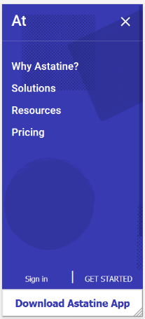
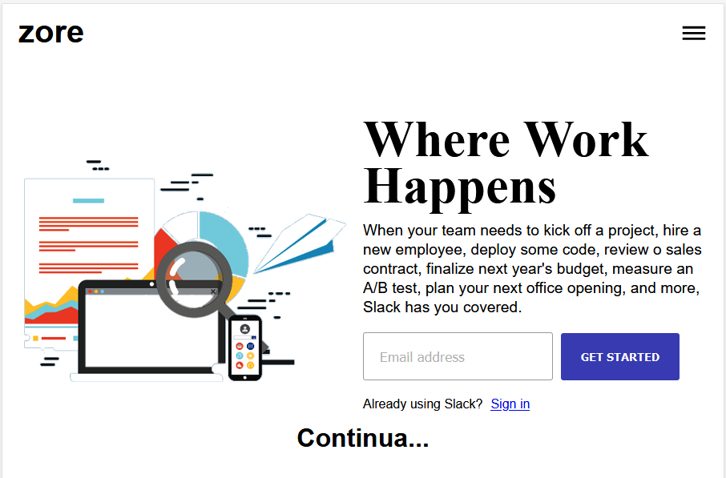
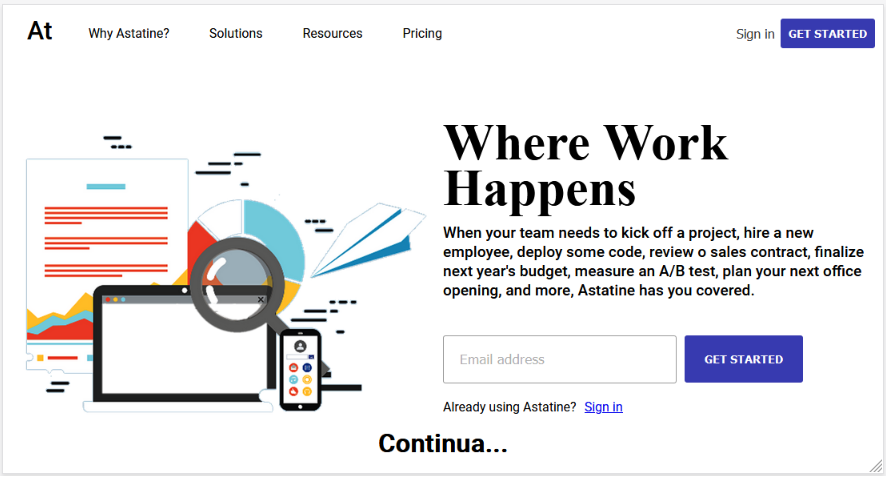

# Projeto: Clone Homepage Slack
Um clone da homepage do site Slack

### Utilidade:

- Aplicação frontend em React e Styled Components usada como aprendizado no uso de responsividade.

### 300px

### 600px

### 1200px

#### Principais Materiais:

- React
- Styled Components

#### Modo de uso:

1. Abra um terminal ( cmd/propt de comando )
2. Clone o repositório ( git clone git@github.com:RobMota/clone-homepage-reactjs-responsive-slack.git ) em algum local de preferência
3. Acesse a pasta ( cd clone-homepage-reactjs-responsive-slack)
4. E digite os comandos abaixo:

- `npm install`
- `npm start`
